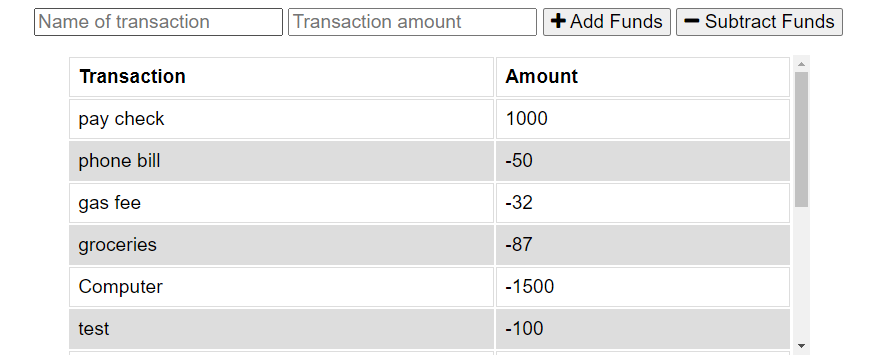
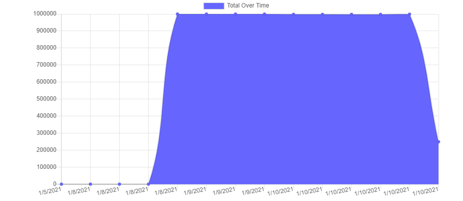

# Budget-Tracker

<h1>Application for managing on offline budget.</h1>

Entries are stored in cache while in offline mode and later added to storage when an internet connection is available.

Entries are added to a table which calculates a running sum.

 
<hl size=3>

Additionally, the accompanying chart can help provide a great representation of cash flow.

